# Bootstrap Overview — AI Marketing Team Setup

> **Audience:** Business owners, non-technical stakeholders.
> **Purpose:** Understand what happens end-to-end before starting.

---

## What you're building

A fully automated AI marketing team that runs inside Claude Desktop:

- **Website** — Next.js site on Vercel, connected to a database (Supabase)
- **AI Agents** — Project Manager, Product Manager, Web Developer, Designer, Writer, Marketing Manager, Social Media Manager
- **Automated schedules** — Daily standups, content calendar generation, weekly reports — all running Mon–Fri without you lifting a finger

---

## Time & effort summary

| Who does the work | How much | When |
|---|---|---|
| You (browser tasks) | ~1–1.5 hours total | P0 and parts of P2 |
| Claude (automated) | ~4–6 hours total | P1–P4 |
| **Total elapsed time** | **~5–7 hours across 2–3 sessions** | Spread over 1–2 days |

---

## The 5 phases

### P0 — Accounts (You, ~45–60 min)
Manual browser work. Create accounts and note credentials.
- Claude Desktop Pro (if not already installed)
- GitHub (code repository)
- Vercel (website hosting)
- Supabase (database)
- Brevo or email platform of choice
- Telegram bot (optional — for AI team notifications)

**Output:** All credentials noted. Ready for Claude Code.

---

### P1 — Local Setup (Claude, ~20–30 min)
Claude installs developer tools and scaffolds your project on your laptop.
- **Stage A (Cowork):** Installs git, node, Vercel CLI, Supabase CLI, authenticates GitHub, pre-seeds all Claude Code permissions so no prompts appear later
- **Stage B (Code):** Creates project folder, writes CLAUDE.md rules, sets up folder structure, configures Supabase MCP, installs skills

**Output:** Project repo on GitHub. Claude Code fully configured.

---

### P2 — Website Infrastructure + Core Agent Setup (Claude + You, ~45–60 min)
Claude asks 2 setup questions, runs a brand intake, scaffolds your website, and installs the 4 core agents.
- **Brand intake:** share a URL, attach documents, or say "create a starting package" — Claude generates all resource files immediately
- Generates: `brand-voice.md`, `design-system.md`, `web-style-guide.md`, audience personas
- Scaffolds full Next.js website (homepage, about, blog, contact) using your real brand colours
- Deploys to Vercel, wires Supabase database
- Installs 4 core agents: Project Manager, Writer, Designer, Web Developer — each referencing real brand files from day one
- Auto-registers PM schedules (standup reminder, compile, EOD, weekly RAG)

**Output:** Live website. Brand resource files written. 4 agents installed. PM schedules active.

---

### P3 — Business Discovery + Agent Customisation (Claude, ~90–120 min)
A full discovery interview captures your business in depth, then Claude personalises each agent.
- 26-question interview (business identity, audience, channels, visual style, content strategy)
- Updates all 4 core agents with real business context — removes all placeholders
- Updates website pages with real copy (hero, about, nav, footer, CSS variables)
- Optionally adds specialist agents: Product Manager, Marketing Manager, Social Media Manager — each built via the 5-step workflow (interview → design → review → generate → install)

**Output:** Agents personalised with real data. Full resource file set. Website with real content.

---

### P4 — Schedules + Verification (Claude + You, ~30–45 min)
Claude generates schedule commands and guides you through activating them in Claude Desktop.
- Generates copy-paste `/schedule` commands for all automated tasks
- You activate each schedule in the Claude Desktop Chat tab
- Claude runs end-to-end verification (file checks + 3 functional agent tests)
- Optional: OpenClaw upgrade for WhatsApp control and TikTok video generation

**Output:** All schedules active. System verified. Your AI team is running.

---

## Process diagram

```mermaid
flowchart TD
    START([You: paste INDEX.md into Claude Code]) --> P0

    subgraph P0["P0 — Accounts  (~45–60 min)  📋 You in browser"]
        P0A[Create GitHub account]
        P0B[Create Vercel account]
        P0C[Create Supabase project\nCopy Project URL + Anon Key]
        P0D[Set up email platform\nBrevo recommended]
        P0E[Create Telegram bot\noptional]
        P0A --> P0B --> P0C --> P0D --> P0E
    end

    subgraph P1["P1 — Local Setup  (~20–30 min)  💻 Claude: Cowork → Code"]
        P1A["Stage A — Cowork\nInstall git, node, Vercel CLI\nGitHub auth\nPre-seed permissions"]
        P1B["Stage B — Code\nCreate project folder + git init\nWrite CLAUDE.md rules\nConfigure Supabase MCP\nInstall skills"]
        P1A --> P1B
    end

    subgraph P2["P2 — Website + Core Agents  (~45–60 min)  🤖 Claude Code"]
        P2A["Brand intake\nURL crawl / docs / default package\n→ write brand resource files"]
        P2B["Scaffold Next.js website\nHomepage · About · Blog · Contact\nusing real brand colours"]
        P2C["Install 4 core agents\nPM · Writer · Designer · Web Dev\nwith real resource references"]
        P2D["Deploy to Vercel · Wire Supabase\nAuto-register PM schedules via MCP"]
        P2A --> P2B --> P2C --> P2D
    end

    subgraph P3["P3 — Discovery + Customisation  (~90–120 min)  🤖 Claude Code"]
        P3A["26-question discovery interview\nbusiness · audience · channels\nvisual style · content strategy"]
        P3B["Personalise 4 core agents\nreplace placeholders with real data\nupdate website pages with real copy"]
        P3C["Optional extended agents\nProduct Manager · Marketing Manager\nSocial Media Manager"]
        P3D["5-step workflow per extended agent\nInterview → Design → Review → Generate → Install"]
        P3A --> P3B --> P3C --> P3D
    end

    subgraph P4["P4 — Schedules + Verification  (~30–45 min)  🤖 Code → 💬 Chat"]
        P4A["Generate /schedule commands\nfor all automated tasks"]
        P4B["You: activate schedules\nin Claude Desktop Chat tab"]
        P4C["Verification\nFile checks + 3 agent tests"]
        P4D["System live ✅\nOptional: OpenClaw upgrade"]
        P4A --> P4B --> P4C --> P4D
    end

    P0 -->|"credentials ready"| P1
    P1 -->|"repo on GitHub"| P2
    P2 -->|"website live + brand files written"| P3
    P3 -->|"all agents installed"| P4
    P4 --> END([🎉 AI team running Mon–Fri])

    style P0 fill:#FEF3C7,stroke:#D97706,color:#000
    style P1 fill:#DBEAFE,stroke:#2563EB,color:#000
    style P2 fill:#EDE9FE,stroke:#7C3AED,color:#000
    style P3 fill:#D1FAE5,stroke:#059669,color:#000
    style P4 fill:#CFFAFE,stroke:#0891B2,color:#000
    style START fill:#F9FAFB,stroke:#6B7280
    style END fill:#F0FDF4,stroke:#16A34A
```

---

## What runs automatically after setup

| Task | When | Who |
|------|------|-----|
| Morning standup reminder | Mon–Fri 7am | Project Manager |
| Compile daily briefing | Mon–Fri 9am | Project Manager |
| EOD check-in reminder | Mon–Fri 5pm | Project Manager |
| Monthly content calendar | 1st of month 9am | Marketing Manager (if installed) |
| Weekly RAG report | Friday 4pm | Project Manager |

Everything else is on-demand — you trigger agents by typing phrases like "help me write my standup" or "@writer write a post about X".

---

## What always requires your approval

- Social media drafts — always shown for review before any posting
- Email campaigns — non-negotiable human approval before sending
- Blog posts — you review before the Web Developer publishes
- Paid spend (ads, subscriptions) — always your decision
