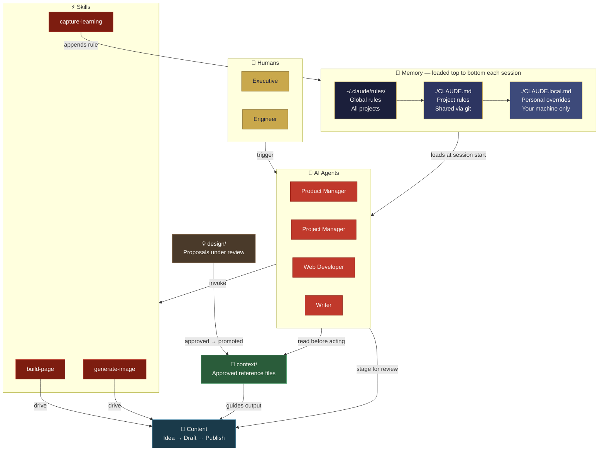

# CLAUDE.md Framework — Overview
## How Memory, Rules, and Agents Work Together

> High-level reference for executives. No code required to understand this diagram.

---

---

## Reading the Diagram

### Three zones to understand

**Memory layers (top-left blue)** — Claude reads these files automatically at the start of every session, in order from global to local. Think of them as nested briefing documents: the outer layer sets universal rules, the middle layer sets project rules, the inner layer sets your personal notes.

**Agents (red)** — Each agent is a specialist. The Product Manager handles ideas and strategy. The Project Manager handles delivery and risk. The Web Developer turns approved drafts into web pages. The Writer produces blog content. No agent acts without reading its own persona first.

**Content lifecycle (bottom-centre)** — An idea becomes a draft in `content/`, gets human review, is built into a page by the Web Developer agent, and is published to the website. The publish log records every step.

### The two most important flows

**Design → Context promotion:** New ideas and proposals go into `design/` first. They are not instructions — they are proposals. Only after human approval do they move into `context/`, where agents treat them as authoritative reference material. This prevents unreviewed plans from accidentally becoming agent behaviour.

**Continuous improvement loop:** When you confirm that a solution worked ("yes, perfect"), Claude automatically captures that as a new rule in CLAUDE.md. The rule is shown to you before it is written. Over time, the system gets smarter without you having to manually maintain it.

---

## The Golden Rule

> **`context/` = approved and active. `design/` = proposed and under review.**
>
> Nothing enters `context/` until a human has approved it.
> Nothing that is approved stays in `design/`.

---

*Overview version: 1.0 — Based on Mahjong Tarot project structure.*
