# Mahjong Tarot Astrologer Portal
## User Guide — v1.0

**For:** Bill Hajdu (Astrologer) and Dave Hajdu (Operator)
**Date:** 2026-05-20
**Live URL:** [mahjongtarot.com/portal](https://mahjongtarot.com/portal)

---

## Welcome

The portal is your private workspace on mahjongtarot.com. It lives behind your sign-in and lets you:

- See every session you have on the calendar (past and future)
- Keep a record of every client you've read for, with their birth info and contact details
- After a call, write up a polished report and email it to the client with one click
- (For Dave + Yon) Track which clients haven't subscribed yet and follow up

This guide walks through every screen. Each section has a screenshot showing what you'll see.

If you're stuck at any point, email Yon at yon@edge8.co.

---

## Part 1 — Getting Started (everyone)

### 1.1 Signing in

Go to **mahjongtarot.com/sign-in**.

Enter your email and password. Your account is already set up — Bill uses `firepig01@gmail.com`, Dave uses `dhajdu@gmail.com`.

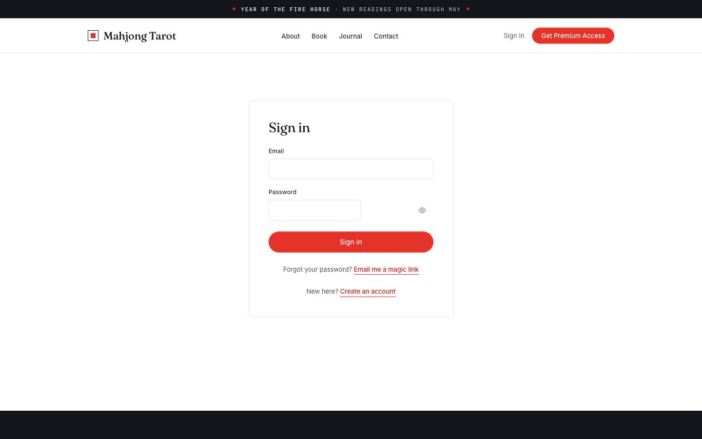

After you sign in, the site knows your role and sends you to the right place:

- **Bill** (Astrologer) → lands on `/portal` (your sessions dashboard)
- **Dave** (Admin) → lands on `/portal` as well, with an extra "Conversions" link in the navigation
- Regular site members → land on `/dashboard` (the public member area, separate from the portal)

You only see the portal when you sign in. Customers visiting the public site never see it.

### 1.2 Signing out

Click your name in the top-right corner of any portal page and choose **Sign out**.

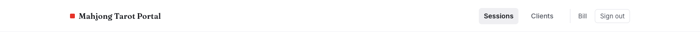

---

## Part 2 — For Bill (Practitioner)

This is the part of the portal you'll use every day. It's organized around the way you actually work: see who's coming up, take the call, write the report, send it.

### 2.1 Your sessions dashboard

When you sign in, you land on the **Sessions** page at `/portal`. This is your home base.

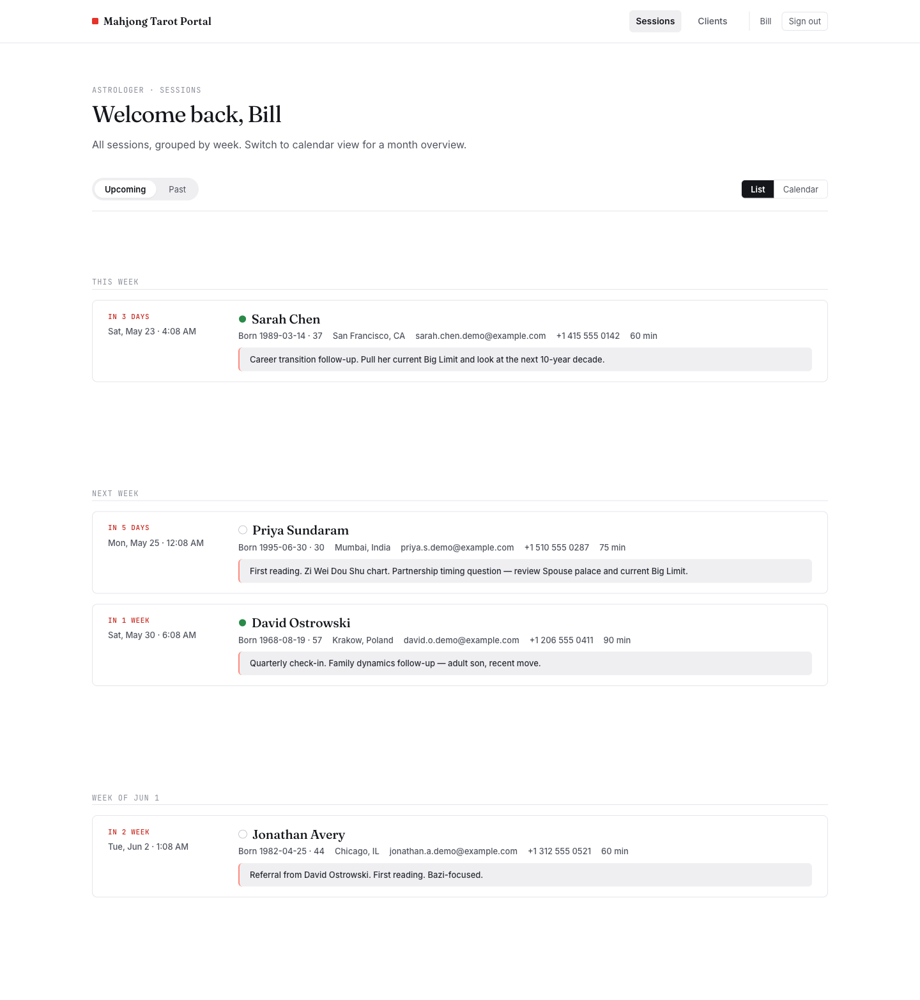

The page has two tabs and two view modes:

**Tabs:**
- **Upcoming** (default) — every session you have coming up, in chronological order
- **Past** — every session you've already had, most recent first

**View modes:**
- **List** (default) — sessions grouped by week (This week / Next week / Week of …)
- **Calendar** — a month grid with each session as a colored pill on its date

Toggle freely between them. Try the **Calendar** view when you want to see your month at a glance:

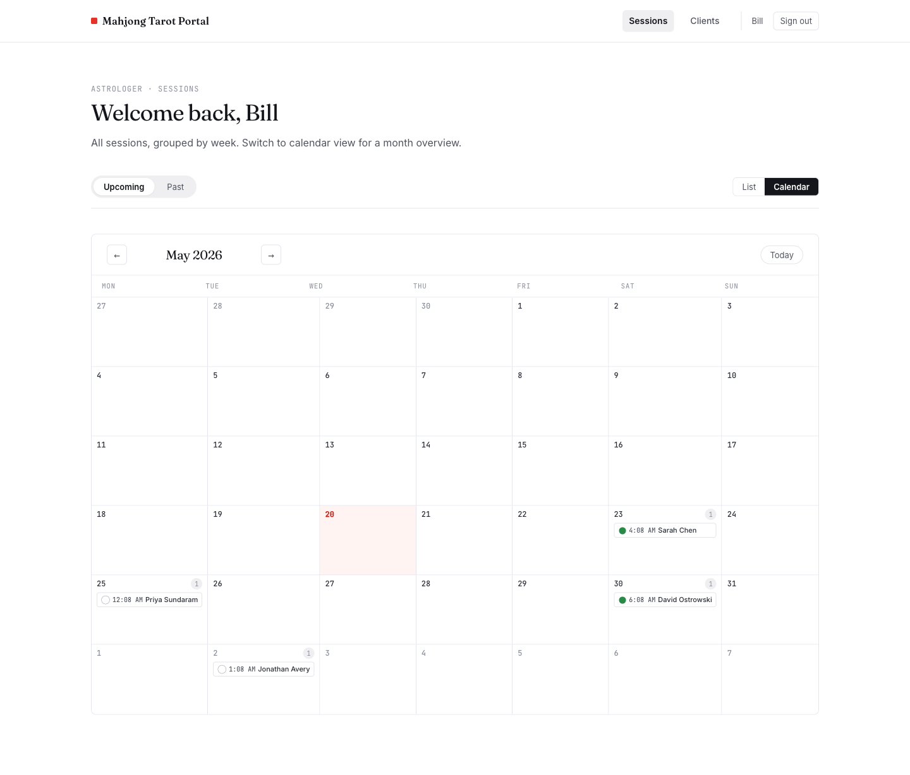

You can also browse past months using the arrow buttons in the calendar header.

### 2.2 The subscription icon

Next to every client name, you'll see a small circle. That's their subscription status:

| Icon | Meaning |
|------|---------|
| ◯  Not subscribed | Hasn't subscribed yet — this is a conversion opportunity |
| ●  Subscribed | Active subscriber |
| ◐  Lapsed | Was subscribed, isn't currently |
| ⊘  Cancelled | Cancelled their subscription |

You'll see this icon on every screen where a client appears. You don't need to do anything with it — it's just a quick visual cue. Dave and Yon handle the actual conversion follow-ups from the admin side.

### 2.3 Your client list

Click **Clients** in the navigation to see everyone you've read for.

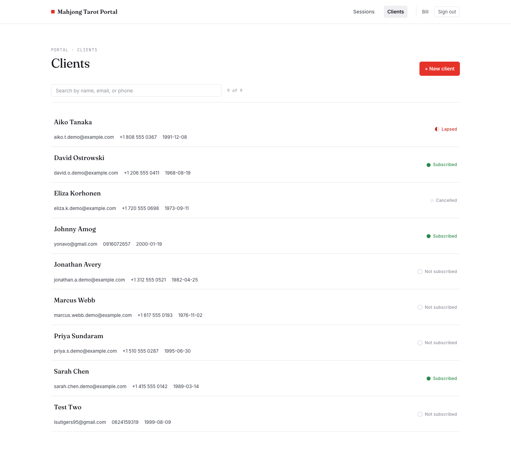

The list shows the client's name, contact info, birthday, and subscription status. Use the **search box** at the top to filter by name, email, or phone.

Click **+ New client** at the top-right to add a new person to the list.

### 2.4 Adding a new client

The **New client** form captures everything you need before the first reading.

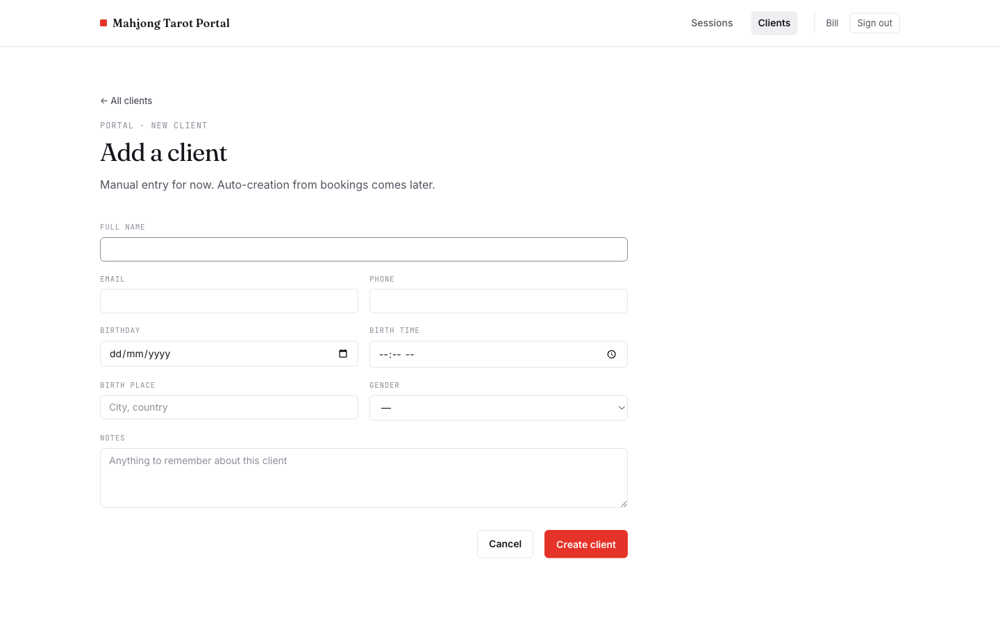

**Required fields:**
- Full name

**Strongly recommended for readings:**
- Email — needed to send them their report later
- Birthday, birth time, birth place — needed for chart-based readings (Bazi, Purple Star, etc.)

**Optional:**
- Phone, gender, notes

Click **Save** when you're done. You'll be taken to that client's profile.

### 2.5 The client profile

Each client has a profile page at `/portal/clients/<their-id>` showing everything you know about them.

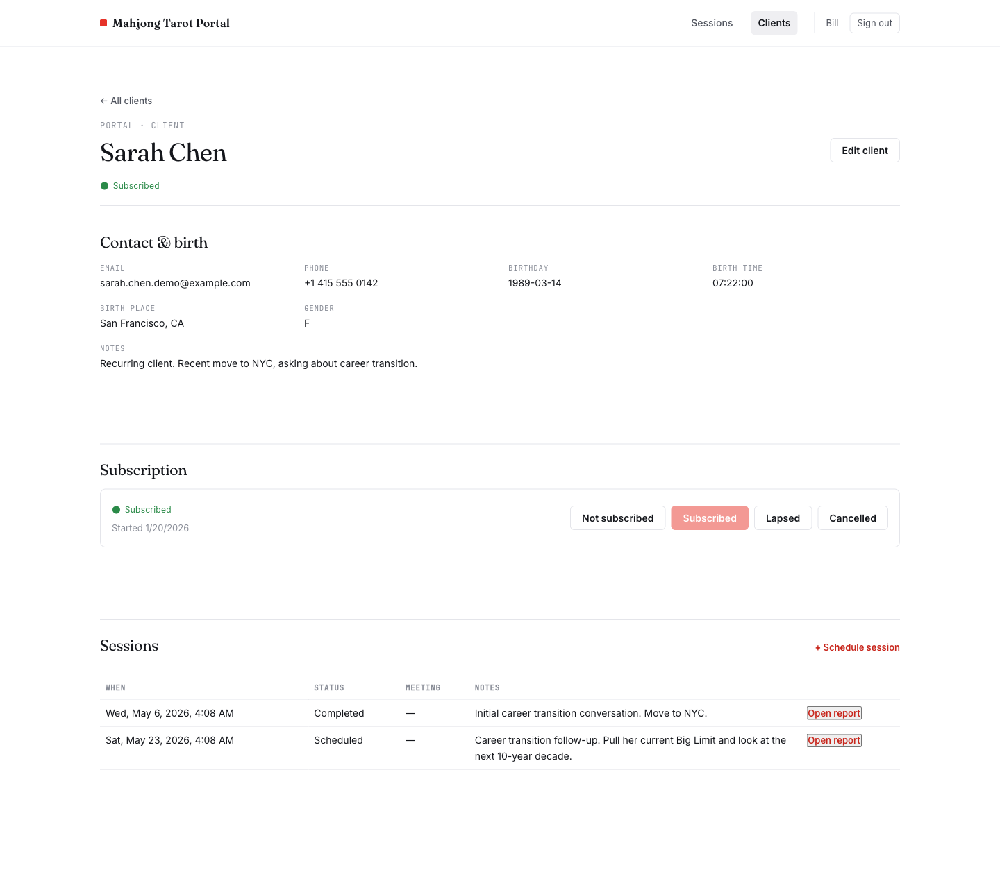

The profile has four sections:

1. **Header** — name, subscription icon + label
2. **Contact + birth info** — click **Edit** at the top-right to change anything
3. **Subscription panel** — see when their subscription started/ended, and use the buttons to mark them subscribed/lapsed/cancelled if needed
4. **Sessions table** — every session you've had with this client, with an **Open report** button on each row

### 2.6 Scheduling a session

There are two ways to schedule:

**From the client profile:**
Click **+ Schedule session** at the top of the Sessions section. The form opens with that client pre-filled.

**From the Clients page:**
Open the client first, then schedule from their profile.

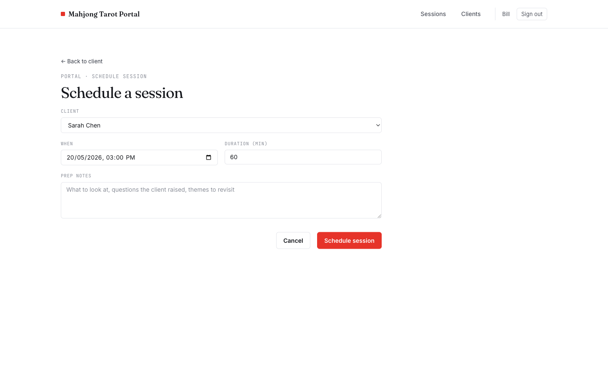

Pick a date and time (it defaults to the next hour). Set the duration (default 60 minutes). Add any **prep notes** — things you want to remember before walking into the call.

Click **Schedule**. The session now appears on your Sessions dashboard.

### 2.7 The post-session workflow (the most important part)

After every reading, you'll do three things in the portal:

1. **Paste the transcript** (from Zoom AI Companion, Krisp, or however you record)
2. **Write or paste the polished report** (using your Claude.ai Project as a draft helper)
3. **Send the report by email** with one click

Here's how each step works.

#### Step 1 — Open the session's report page

From the client's profile, find the session in the Sessions table and click **Open report**.

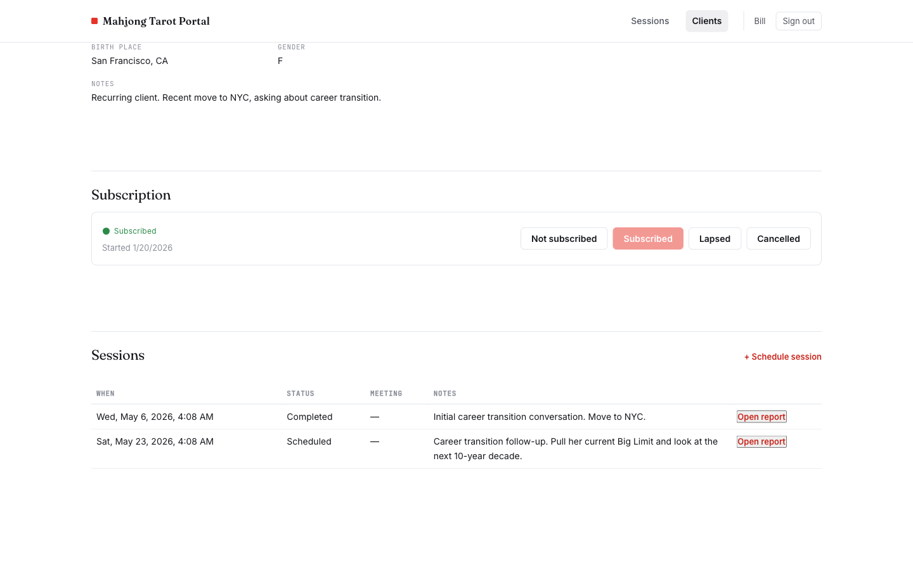

The first time you open a report for a session, the system creates a blank one. Every time after that, you'll see the same report (your work in progress).

You're now on `/portal/reports/<report-id>`:

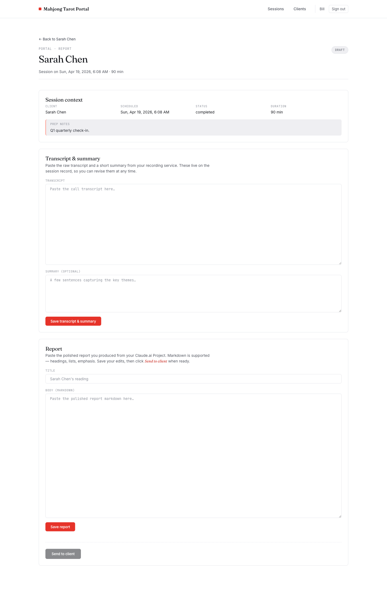

The page has three sections:

1. **Session context** (top) — read-only info about who, when, how long
2. **Transcript & summary** — where you paste raw transcript + optional summary
3. **Report** — where you paste the polished write-up that goes to the client

#### Step 2 — Paste the transcript

After your Zoom (or other) call, your recording service should give you:
- A **transcript** (the raw text of what was said)
- A **summary** (a few bullet points capturing the call) — optional but helpful

Paste them into the two textareas. Click **Save transcript & summary**.

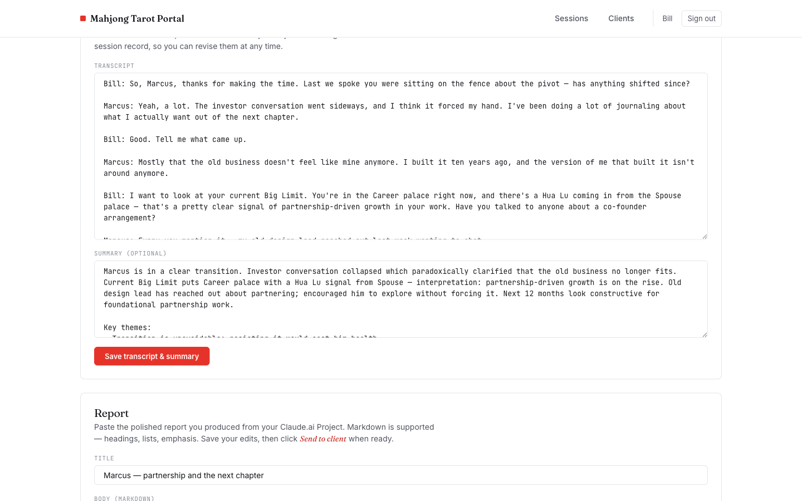

You can come back and edit these any time. They live on the session record.

#### Step 3 — Write the polished report

Open your **Mahjong Tarot Report Writer** Project in Claude.ai (your Max-plan subscription). Paste the transcript or summary in. Claude will produce a polished, voice-matched report. Copy it back.

Paste it into the **Body (markdown)** textarea on the report page. Add a title if you want (otherwise the system uses "{Client name}'s reading"). Click **Save report**.

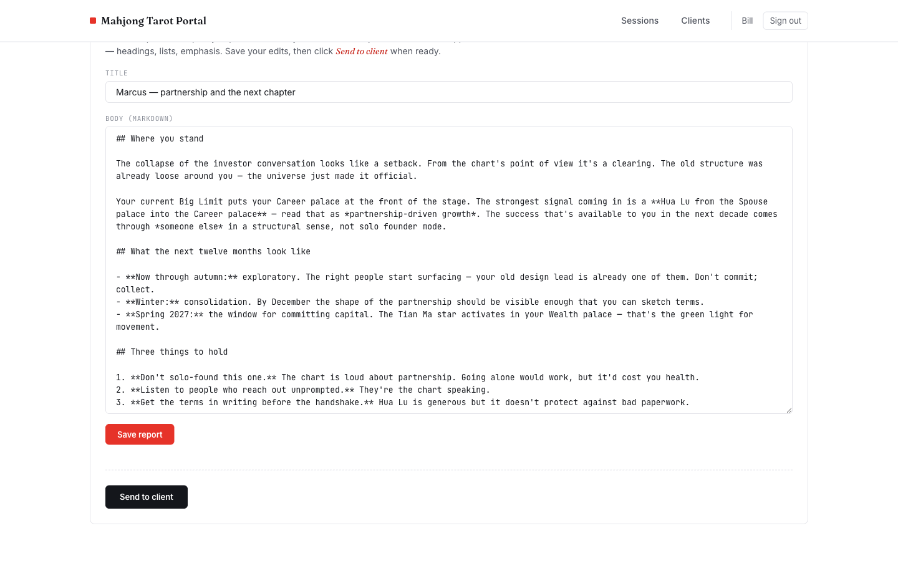

Markdown formatting is supported: `# Headings`, `**bold**`, `*italics*`, `- bullet lists`. The email will render it cleanly.

#### Step 4 — Send to the client

When the report is ready, click **Send to client** at the bottom of the page.

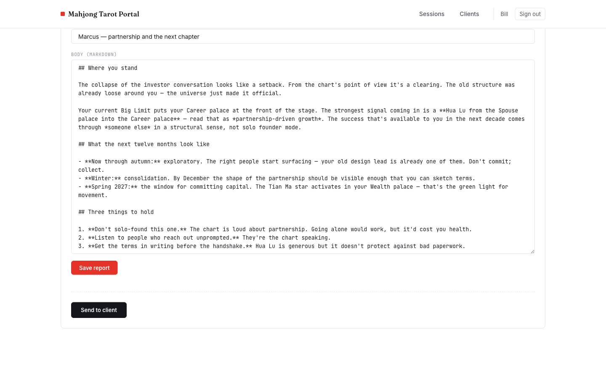

You'll see a confirmation showing the client's email. Click OK.

A few seconds later, the status flips to **Sent** and the page shows when it was sent and to which email:

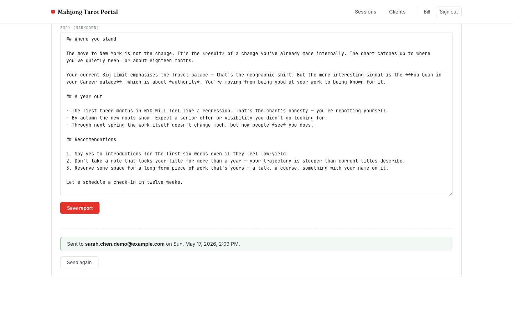

The client receives an email like this:

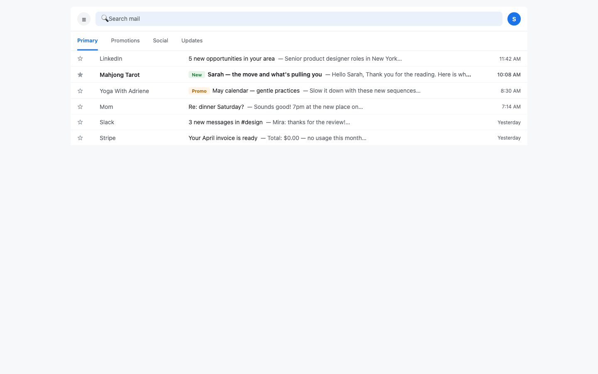

When they open it, they see your polished report followed by an **"Explore The Mahjong Mirror →"** button that takes them to the Mirror page on mahjongtarot.com — your conversion surface.

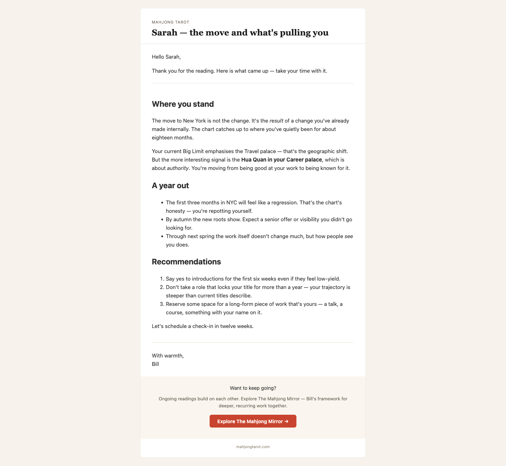

You can resend the report later if you need to — click the **Send again** button. (You'll get a confirmation prompt.)

### 2.8 What if something goes wrong?

- **The page is stuck on Loading…** — refresh the page (Cmd+R / Ctrl+R). If still stuck, sign out and back in.
- **Save took >15 seconds** — you'll see a timeout error. Refresh and try again.
- **Client didn't receive the email** — check the report's "Sent to" field on `/portal/reports/<id>`. If the address is wrong, edit the client profile and resend.
- **Anything else** — email Yon at yon@edge8.co with a screenshot.

---

## Part 3 — For Dave (Operator)

You can do everything Bill can — that's all of Part 2. You also have an extra page focused on conversion.

### 3.1 The Conversions dashboard

You'll see an extra **Conversions** link in the portal navigation. Bill doesn't see this — it's admin-only.

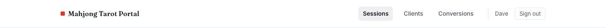

Click it to open `/portal/admin/conversions`:

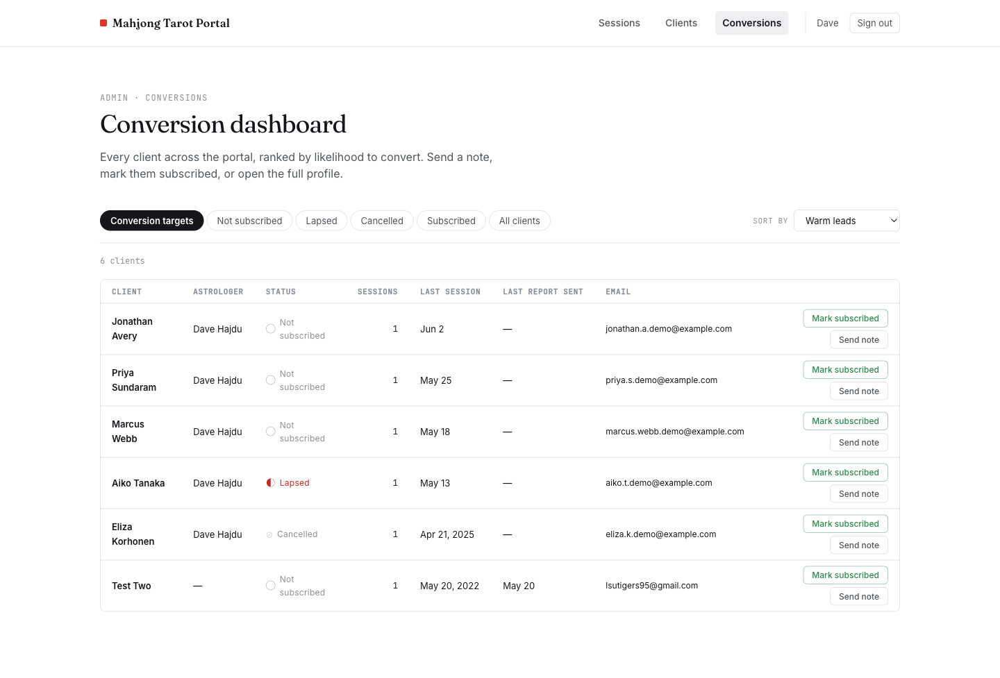

The page shows every client across the system (not just yours) — every person Bill has ever read for, regardless of who scheduled it.

**Columns:**
- Client name — click to open the full profile
- Astrologer — who they're working with (currently always Bill)
- Status — subscription state with icon
- Sessions — how many they've had
- Last session — when their most recent reading was
- Last report sent — when Bill last emailed them
- Email — for outreach
- Actions

### 3.2 Filters and sort

The filter chips at the top control what shows:

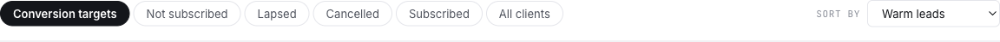

- **Conversion targets** (default) — Not subscribed + Lapsed + Cancelled. The people most worth following up with.
- **Not subscribed**, **Lapsed**, **Cancelled** — drill down to a specific status
- **Subscribed** — see existing subscribers (useful to confirm a recent conversion)
- **All clients** — no filter

**Sort options:**
- **Warm leads** (default) — non-subscribed clients with a recent session, ordered by recency. These are your highest-probability conversions.
- **Recent activity** — pure recency sort regardless of status
- **A → Z** — alphabetical

### 3.3 Marking someone as subscribed

When someone subscribes (currently a manual process — you'll add Stripe later), find them in the table and click **Mark subscribed**.

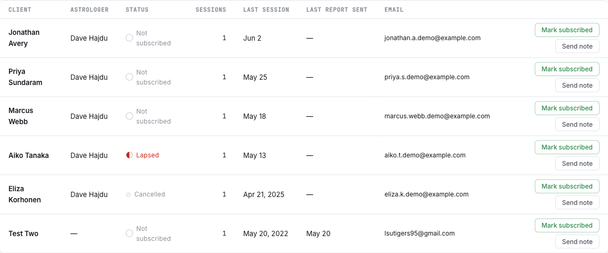

The row updates instantly:
- The status icon flips to green ● Subscribed
- If the **Warm leads** sort is on, the row drops out of view (since they're no longer a target)
- Bill sees the new status next to that client's name everywhere in his portal

### 3.4 Sending a follow-up note

To reach out to a client without using the report flow (e.g. "Hi, want to schedule another reading?"), click **Send note** on their row.

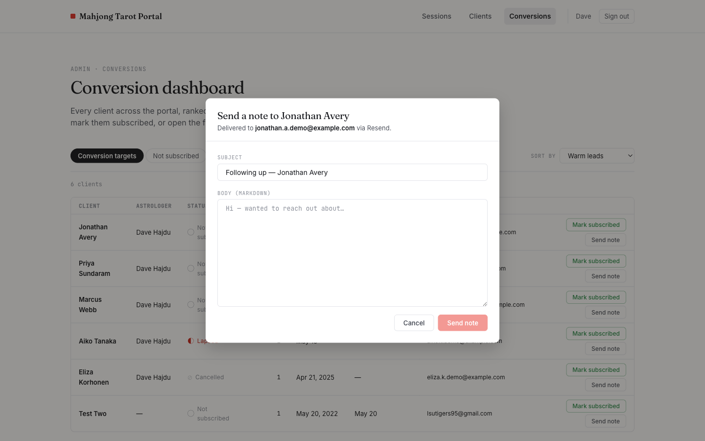

The modal pre-fills a subject like "Following up — Jane Doe". Write a short body in markdown. Click **Send note**. The client receives an email branded as Mahjong Tarot, with a reply-to address that lands in Bill's inbox.

This is useful for nudges, schedule reminders, or anything that doesn't warrant a full report.

### 3.5 The role system

Three roles exist in the database:

| Role | What they see |
|------|---------------|
| **member** | Regular site users. See `/dashboard` and public content. No portal access. |
| **astrologer** | Bill. Lands in `/portal` after sign-in. Full portal access. No `/admin` or `/portal/admin/*` access. |
| **admin** | Dave + Yon. Everything Bill has, plus `/admin` (legacy inquiry dashboard) and `/portal/admin/conversions`. |

Roles are set on the profiles table in Supabase. New signups default to `member`. Promoting someone is a single SQL update — ask Yon.

### 3.6 When to escalate to Yon

You can handle most things yourself. Loop Yon in when:

- A user can't sign in (their account isn't promoted, or password reset issue)
- The portal returns errors you don't recognize
- You want to change the layout, copy, or add a feature
- Stripe / payment integration questions (coming in v2)
- Email isn't arriving (Resend issue)

Yon: **yon@edge8.co**

---

## Part 4 — Quick reference

### Status icons

| Icon | Status | Meaning |
|------|--------|---------|
| ◯ | Not subscribed | Conversion opportunity |
| ● | Subscribed | Active subscriber |
| ◐ | Lapsed | Was subscribed, isn't currently |
| ⊘ | Cancelled | Cancelled their subscription |

### URLs cheat sheet

| Page | URL |
|------|-----|
| Sign in | `mahjongtarot.com/sign-in` |
| Portal home (Sessions) | `mahjongtarot.com/portal` |
| Clients list | `mahjongtarot.com/portal/clients` |
| New client | `mahjongtarot.com/portal/clients/new` |
| Client profile | `mahjongtarot.com/portal/clients/<id>` |
| New session | `mahjongtarot.com/portal/sessions/new` |
| Report editor | `mahjongtarot.com/portal/reports/<id>` |
| Conversions (admin) | `mahjongtarot.com/portal/admin/conversions` |
| Legacy admin (inquiries) | `mahjongtarot.com/admin` |

### Glossary

- **Astrologer** — the practitioner role. Bill.
- **Admin** — the operator role. Dave + Yon.
- **Session** — a scheduled reading on the calendar.
- **Report** — the written write-up sent to the client after a session. One per session.
- **The Mahjong Mirror** — Bill's framework / book. The conversion CTA in every report email links here.
- **Subscription** — currently a manual status on the client record. Stripe integration deferred to v2.

### What's not built yet (coming soon)

- **Stripe Payment Link** for self-serve subscriptions — for now Dave marks subscribed manually
- **Subscribe landing page** at `/continue` or `/subscribe` — coming in v2
- **Auto-pull transcripts** from Zoom / Krisp / Otter — manual paste for now
- **AI-drafted reports inside the portal** — use your Claude.ai Project for now
- **Client-facing report archive** — clients receive reports by email only; no in-site reader yet
- **PDF export of reports**

If you want any of these, tell Yon.

---

**End of guide.** Questions, bugs, feature requests → yon@edge8.co.
